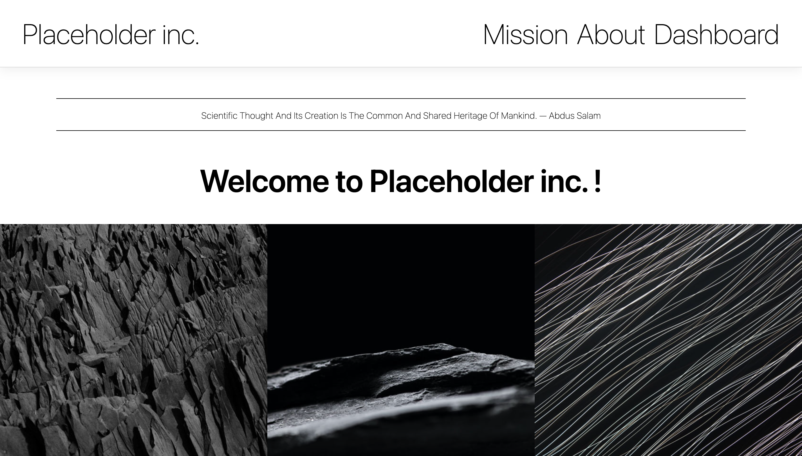
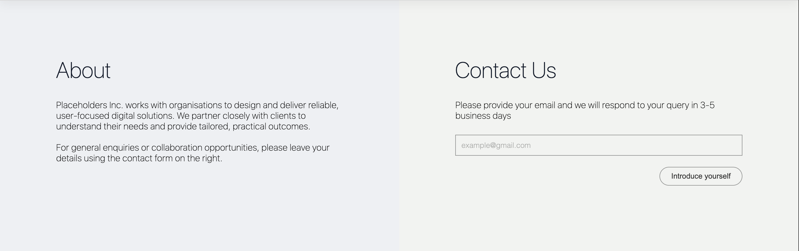
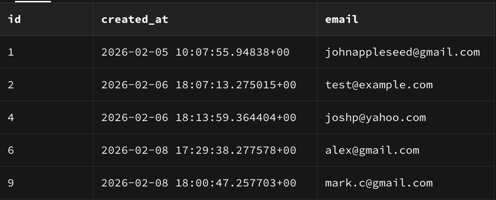

# Placeholder Inc.

A full-stack web application featuring a responsive company website with a production-ready backend API, persistent database storage, and automated testing.

The project combines a static front end deployed on Netlify with a Node.js/Express backend deployed on Render, connected to a PostgreSQL database hosted on Supabase.

Live site:
https://placeholder-company-website.netlify.app

Backend API:
https://company-website-mqmv.onrender.com

## Overview

Placeholder Inc. simulates a modern company landing page with interactive UI components and a real backend system behind the scenes.

Visitors can submit their email via the contact form. The email is validated on the server and stored securely in a PostgreSQL database. The application also demonstrates fetching data from an external API, modal UI patterns, and mobile-responsive design.

This project was built to demonstrate end-to-end web development skills: frontend UI, backend architecture, database design, testing, and deployment.

## Key Features

**Frontend**

- Responsive layout (desktop, mobile)

- Fixed navigation with smooth scrolling

- Interactive image section (layout toggle)

- Dashboard cards with modal popups

- External API–driven quotes that update automatically

- Contact form with real backend integration

**Backend**

- RESTful API built with Node.js and Express

- Clear separation of concerns (routes, controllers, models)

- Server-side validation and sanitisation

- Parameterised SQL queries (SQL injection safe)

- PostgreSQL database with unique email constraint

- Environment-based configuration (development / test / production)

## Testing

- API endpoint tests using Jest and Supertest

- Automatic database seeding for tests

- Tests run without affecting production data

## Screenshots

**Landing page (desktop):**



**Contact form submission:**


**Stored emails in Supabase:**



Further screenshots for dashboard and email validation stored in assets/ 

## Tech Stack

### Frontend

- HTML

- CSS

- Vanilla JavaScript

### Backend

- Node.js

- Express

- PostgreSQL

- node-postgres (pg)

## Tooling & Testing

- Jest

- Supertest

- dotenv

- nodemon

## Deployment

Frontend: Netlify

Backend: Render

Database: Supabase (PostgreSQL)

## API Endpoints

**Health check:**

```
GET /api/health
```

Returns a simple OK response for service monitoring.

**Contacts:**

```
GET /api/contacts
POST /api/contacts
```

POST example input with Insomnia:

```
{
"email": "user@example.com"
}
```

Validates email format

Prevents duplicate entries

Returns appropriate HTTP status codes

## Project Structure

This repository contains both the frontend and backend for the application.

### Frontend (root directory)

```
.
├── index.html
├── styles.css
├── script.js
├── images/
├── README.md
```

- A static website built with HTML, CSS, and vanilla JavaScript
- Deployed on Netlify

### Backend (`/server`)

```
server/
├── app.js
├── listen.js
├── db.js
├── routes/
├── controllers/
├── models/
├── errors/
├── db/
│ ├── seed.js
│ └── data/
├── tests/
├── package.json
└── package-lock.json
```

- Express server exposing a REST API
- PostgreSQL database connection
- Automated tests for API endpoints
- Deployed on Render

## Environment Variables

The backend uses different databases per environment.

.env.production
DATABASE_URL=postgresql://...

.env.test
PGDATABASE=company_website_test

Environment selection is handled automatically via NODE_ENV.

## Running Locally

Clone the repo:

```
git clone https://github.com/ofeore/company-website.git
cd company-website
```

Install backend dependencies:

```
cd server
npm install
```

Seed the database:

```
npm run seed
```

Run the server:

```
npm run dev
```

Server runs on:

http://localhost:3001

## Running Tests

```
cd server
npm test
```

Tests run against a dedicated test database and do not affect production data.

## Future Improvements

- Pagination and rate limiting on API endpoints

- Observability (metrics, logging, monitoring)

- Authentication for admin access

- Expanded dashboard data sources

## Why This Project

This project demonstrates:

- Real-world backend architecture

- Database design and safety (parameterized queries)

- API testing discipline

- Deployment workflows

- Clean separation of concerns
